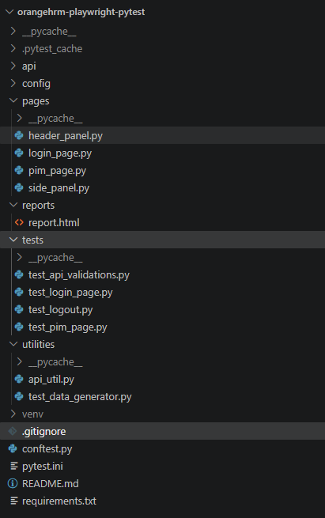

# OrangeHRM Playwright + Pytest Automation

This repository contains automated tests for validating **OrangeHRM** functionality using **Playwright** and **Pytest**.  
It includes both **API tests** and **UI tests**, with strict ordering to ensure data consistency across test runs.

---

## 🚀 Features
- **API validation tests**: Verify employee data consistency between API and UI.
- **UI tests**: Perform actions such as employee deletion and validate results.
- **Custom Assertions**: Reusable assertion helpers for presence/absence and equality checks.
- **Ordered execution**: API tests run before UI tests to ensure proper sequencing.
- **HTML reports**: Pytest generates detailed reports for each run.
- **Locator strategy**: Flexible handling of locators depending on project size.
- **Test data management**: Centralized JSON file for consistent test inputs.

---

## 📂 Project Structure




---

## 🛠️ Setup

1. Clone the repository:
   ```bash
   git clone https://github.com/Aakshaynthorangehrm_playwright_pytest_akshay_n
   cd orangehrm-playwright-pytest

2. Create and activate a virtual environment:
    python -m venv venv
    source venv/bin/activate   # Linux/Mac
    venv\Scripts\activate      # Windows

3. Install dependencies:

    pip install -r requirements.txt


▶️ Running Tests 

Run all tests:
pytest -v --html=reports/report.html --self-contained-html

Run only smoke tests:
pytest -m smoke

Run only regression tests:
pytest -m regression

🧩 Custom Assertions
    Located in utilities/api_util.py, the Assertions class provides reusable helpers:

    Presence check:
    Assertions.assert_in_response(test_data, response)
    
    Absence check:
    Assertions.assert_not_in_response(test_data, response)

    Equality check:
    Assertions.assert_equal(expected, actual, "field_name")

    Not equal check:
    Assertions.assert_not_equal(expected, actual, "field_name")

📌 Test Ordering

    Tests use pytest-order to enforce execution sequence:
    API validation runs first (@pytest.mark.order(1)).
    UI deletion runs second (@pytest.mark.order(2)).
    This ensures data validated by the API is deleted only after verification.

📊 Reports
    After each run, an HTML report is generated at: reports/report.html

✅ Best Practices
    Keep test_data consistent across API and UI tests.
    Use Assertions helpers for clear, reusable validations.
    Run API tests after UI tests based on dependency to avoid data mismatch.


---
## 👨‍💻 Created By
Akshay N